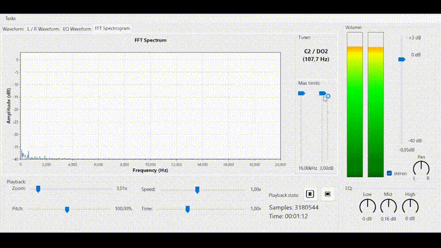
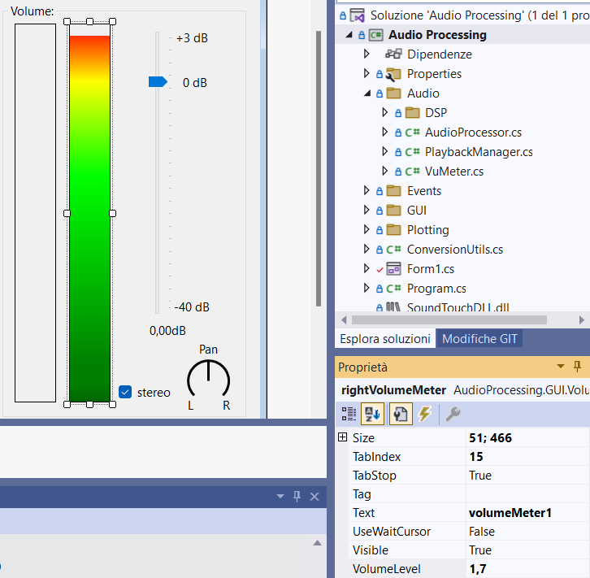

# Audio Processing

\
Audio Processing is an advanced audio analysis and processing application designed to provide a wide range of features for audio enthusiasts and professionals.

 

## Key Features
- **Waveform Graphs:** Visualize audio waveforms in real-time.
- **Mono/Stereo Channels:** Support for both mono and stereo audio channels.
- **Logarithmic dB Scale VU Meter:** Accurate volume metering with a logarithmic dB scale.
- **FFT Graph:** Display real-time FFT (Fast Fourier Transform) graphs for frequency analysis.
- **Equalizer with Low/Mid/High Controls:** Fine-tune audio frequencies with dedicated potentiometers.
- **WAV Import:** Import and work with audio files in WAV format.
- **PrecisionSlider:** Custom slider with float precision, adjustable interval (even negative), and linear, logarithmic, or exponential scale.
- **VolumeMeter:** VuMeter with dB values in a logarithmic scale for precise volume measurement.
- **Microphone Profiling (Upcoming):** Capture and analyze audio from connected microphones.
- **PC Audio Profiling (Upcoming):** Profile audio output from the computer for comprehensive analysis.
- **Pitch Shifting:** Manipulate pitch and perform effects.
- **Time Stretching:** Implement time-stretching techniques for audio modification.
- **Variable Speed without Pitch Influence:** Adjust playback speed without affecting pitch.
- **Tuner:** Analyze and determine the current musical note using FFT.

## Custom Controls

### PrecisionSlider
The PrecisionSlider is a custom slider (trackbar) designed to provide float precision, a customizable interval (even allowing negative values), and the flexibility of linear, logarithmic, or exponential scales.
### VolumeMeter
The VolumeMeter is a VuMeter that accurately measures volume in a logarithmic dB scale, offering precise monitoring similar to analog or digital vu meters.

## Requirements
- Libraries: [NAudio](https://github.com/naudio/NAudio), [ScottPlot](https://github.com/ScottPlot/ScottPlot)

## Known Issues
- **Microphone Profiling**: The current version does not support microphone profiling.
- **PC Audio Capturing**: Capturing audio directly from the PC is not functional in the current release.

### Important
Please note that this project is currently in an alpha/beta stage, and there might be various bugs or issues present. The current version has been pushed to the repository to provide early access to a range of features. Additional functionalities are actively being planned and will be added shortly.
Feel free to report any issues or bugs you encounter, and thank you for your understanding as we work to improve and enhance the software!
